Perfect! Here’s your **complete updated README** with the new **Visual Demo & Screenshots Gallery** section integrated, fully formatted for **VS Code and GitHub**, images centered, sized properly, and filenames fixed with `%20` for spaces.

---

# **ServiceHub – Online Service Booking Platform**

ServiceHub is a modern web application that allows users to discover, book, and review a wide variety of professional services in their area. From plumbing and electrical work to cleaning, gardening, and more, ServiceHub connects users with trusted service providers while offering seamless booking and payment experiences.

---

## **Table of Contents**

* [Project Overview](#project-overview)
* [Features](#features)
* [Tech Stack](#tech-stack)
* [Project Structure](#project-structure)
* [Installation & Setup](#installation--setup)
* [Usage](#usage)
* [API Endpoints](#api-endpoints)
* [Visual Demo & Screenshots Gallery](#visual-demo--screenshots-gallery)
* [Future Enhancements](#future-enhancements)
* [Author](#author)
* [License](#license)

---

## **Project Overview**

ServiceHub provides a user-friendly platform for booking services online. Users can:

* Browse service providers with images, ratings, and categories
* Book services with date/time selection
* Make payments via Stripe integration
* Submit reviews and ratings
* Contact the platform via a real-time contact form using **EmailJS**
* Manage bookings and reviews through a personal dashboard

The backend is connected to a **MongoDB** database storing users, bookings, reviews, and provider information.

---

## **Features**

### **User-Facing Features**

* **Home Page**:

  * Hero section with CTA button
  * Services section with icons, descriptions, and animations
  * About section detailing platform services
  * Contact form integrated with EmailJS

* **Authentication**:

  * User registration and login
  * Token-based authentication for secure endpoints

* **Dashboard**:

  * View providers with images, categories, ratings, and prices
  * Manage bookings and view booking status

* **Booking**:

  * Book a selected provider’s service
  * Choose category and date/time
  * Stripe checkout integration

* **Reviews & Ratings**:

  * Users can submit and view reviews

---

## **Tech Stack**

| Layer                 | Technology/Library                                       |
| --------------------- | -------------------------------------------------------- |
| Frontend              | React.js, React Router, Tailwind CSS, AOS, React Icons   |
| Forms & Notifications | EmailJS, React-Toastify                                  |
| Payment               | Stripe API (Checkout Form)                               |
| Backend               | Node.js, Express.js                                      |
| Database              | MongoDB, Mongoose                                        |
| Deployment            | Vercel/Netlify (Frontend), Heroku/DigitalOcean (Backend) |

---

## **Project Structure**

```plaintext
frontend/
├─ public/
│  ├─ images/
│  │  ├─ home1.png
│  │  ├─ Home-services-section.png
│  │  ├─ Home-about-section.png
│  │  ├─ home-contact-section%20and%20footer.png
│  │  ├─ Dashboard.png
│  │  ├─ dashboard-services1.png
│  │  ├─ dashboard-services2.png
│  │  ├─ dashboard-services3.png
│  │  ├─ dashboard-services4.png
│  │  ├─ dashboard-services5.png
│  │  ├─ dashboard-services6.png
│  │  ├─ dashboard-services7.png
│  │  ├─ dashboard-services8.png
│  │  ├─ reviews%20page.png
│  │  ├─ Bookingspage.png
│  │  ├─ Payment-page.png
│  │  └─ ServiceHUb%20task%20-%20Made%20with%20Clipchamp.mp4
├─ src/
│  ├─ api/api.js
│  ├─ components/
│  ├─ pages/Home.jsx
│  ├─ pages/Dashboard.jsx
│  ├─ pages/Booking.jsx
│  ├─ pages/Reviews.jsx
│  ├─ pages/Login.jsx
│  ├─ pages/Register.jsx
│  ├─ App.jsx
│  └─ index.js
└─ package.json

backend/
├─ models/
├─ routes/
├─ controllers/
├─ middleware/
└─ server.js
```

---

## **Installation & Setup**

### **Frontend**

```bash
cd frontend
npm install
npm start
```

### **Backend**

```bash
cd backend
npm install
# Create a .env file with:
# MONGO_URI=<your-mongodb-connection-string>
# JWT_SECRET=<your-jwt-secret>
# STRIPE_SECRET_KEY=<your-stripe-secret-key>
npm run dev
```

---

## **Usage**

* **Home Page**: View services, read about the platform, and send messages via contact form
* **Register/Login**: Access dashboard and booking features
* **Dashboard**: See providers, book services, and manage bookings
* **Booking Page**: Select service, date/time, and proceed to Stripe checkout
* **Reviews**: Submit or view provider reviews
* **Email Contact**: Contact form sends emails via EmailJS

---

## **API Endpoints**

* **Authentication**:

  * `POST /auth/register` – Register a user
  * `POST /auth/login` – Login and receive token

* **Providers**:

  * `GET /providers` – Get all providers
  * `GET /providers/:id` – Get provider details

* **Bookings**:

  * `POST /bookings` – Create a booking
  * `GET /bookings/my` – Get logged-in user bookings

* **Reviews**:

  * `POST /reviews` – Add a review
  * `GET /reviews/:providerId` – Get provider reviews

---

## **Visual Demo & Screenshots Gallery**

### **Project Overview Video**

Watch a short demo of ServiceHub in action:

<div align="center">
<video width="600" controls>
  <source src="frontend/public/ServiceHUb%20task%20-%20Made%20with%20Clipchamp.mp4" type="video/mp4">
  Your browser does not support the video tag.
</video>
<p><em>ServiceHub – Demo Overview</em></p>
</div>

---

### **Home Page Screenshots**

Explore the landing page sections:

<div align="center">
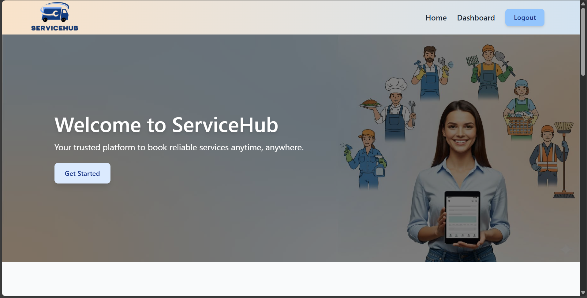
<p><em>Hero Section – Welcome and call-to-action</em></p>

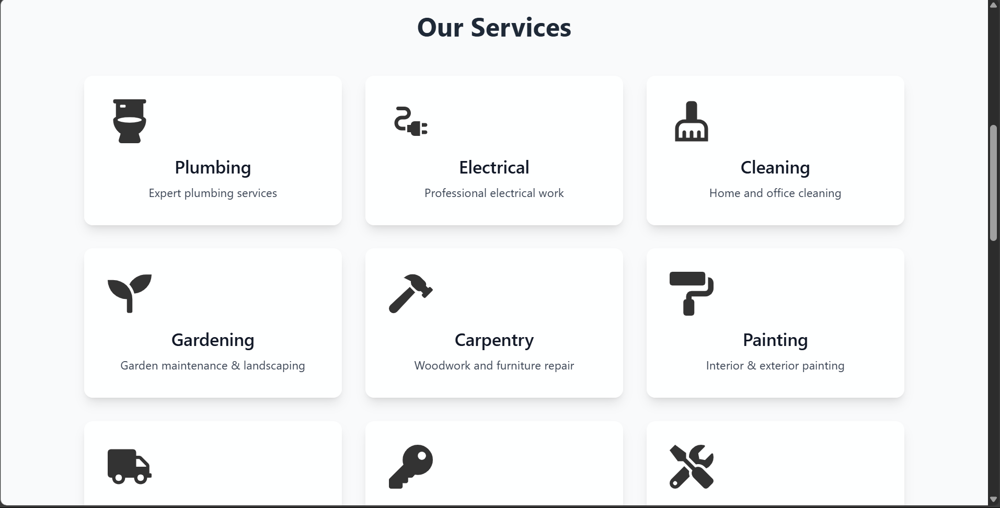
<p><em>Services Section – Available services with icons and descriptions</em></p>

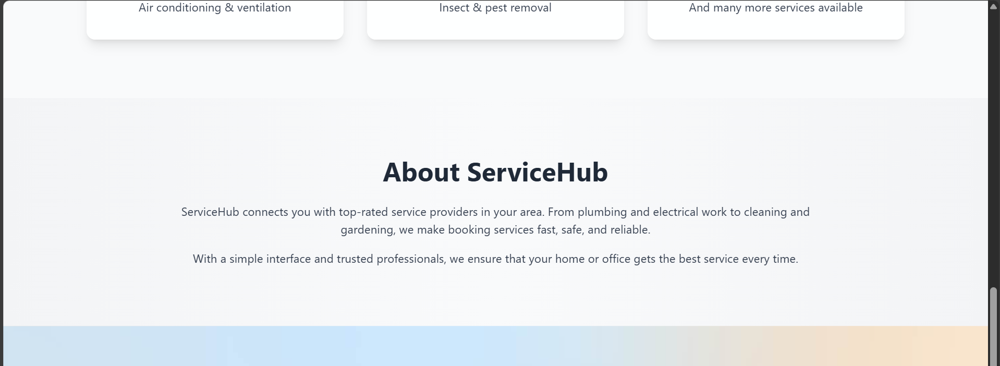
<p><em>About Section – About the platform and benefits</em></p>


<p><em>Contact Section & Footer – EmailJS contact form and quick links</em></p>
</div>

---

### **Dashboard Screenshots**

Manage bookings and view providers:

<div align="center">
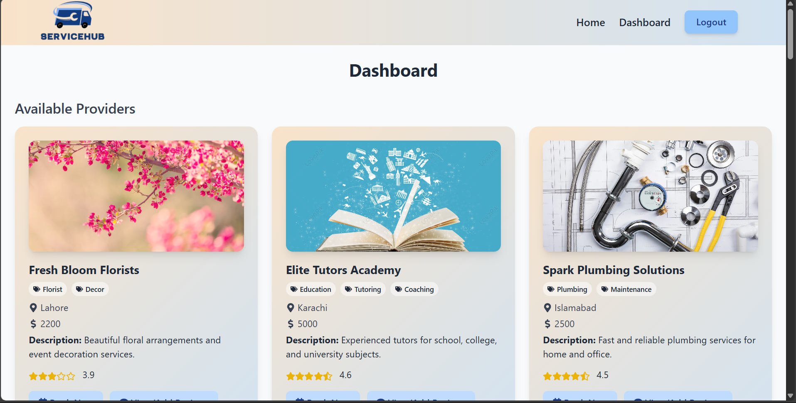
<p><em>Dashboard Overview – User view of available providers and bookings</em></p>

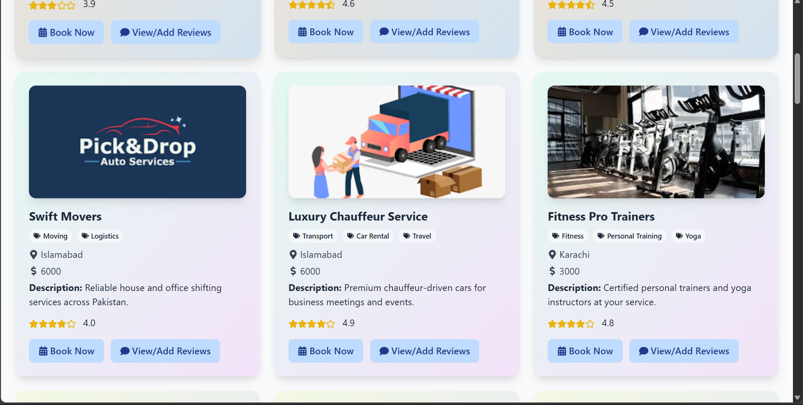
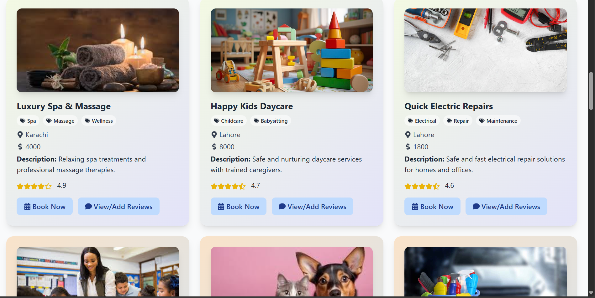
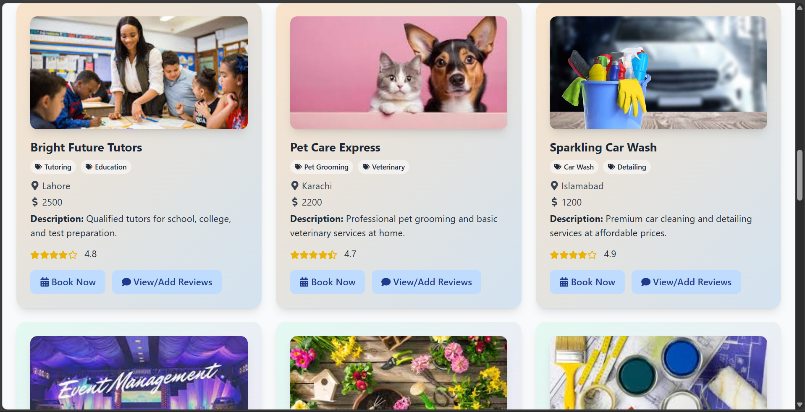
<p><em>Dashboard Providers – Listings 1–3</em></p>

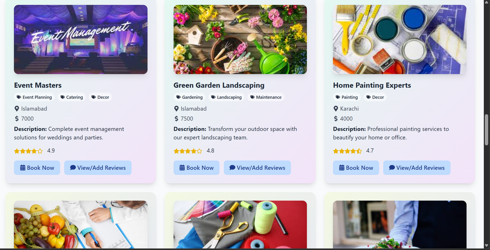
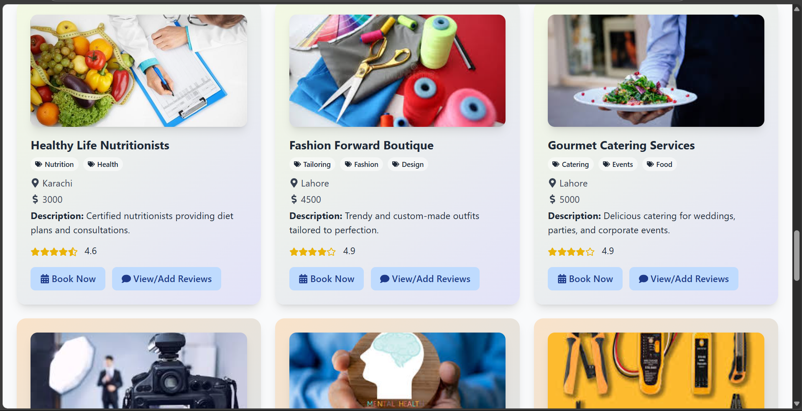

<p><em>Dashboard Providers – Listings 4–6</em></p>

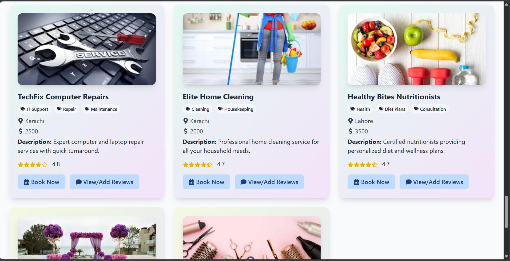
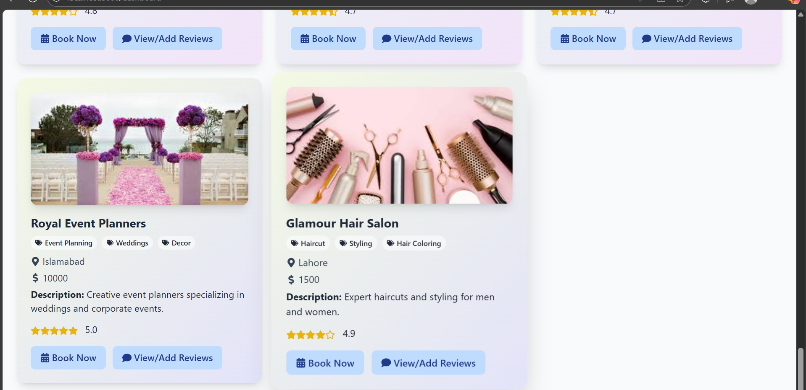
<p><em>Dashboard Providers – Listings 7–8</em></p>
</div>

---

### **Reviews Page Screenshot**

Users can submit and view reviews for providers:

<div align="center">

<p><em>Reviews Page – View and submit provider reviews and ratings</em></p>
</div>

---

### **Booking & Payment Screenshots**

Book services and pay securely:

<div align="center">
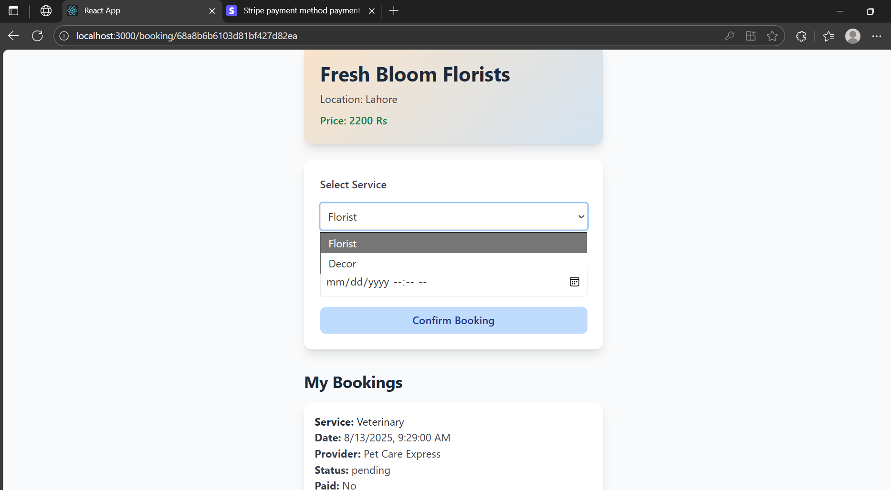
<p><em>Booking Page – Select service, date/time, and confirm booking</em></p>

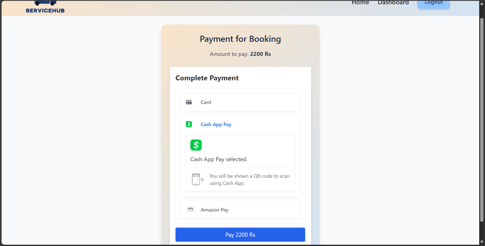
<p><em>Payment Page – Stripe checkout for service payments</em></p>
</div>

---

## **Future Enhancements**

* Admin panel to manage providers and bookings
* Multi-language support
* Mobile app version for iOS and Android
* AI-based service recommendations

---

## **Author**

* **Name**: Insa Abbas
* **Email**: [insaabbas675@gmail.com](mailto:insaabbas675@gmail.com)

---

## **License**

MIT License

---

✅ This README is **fully VS Code ready**, images are centered and scaled nicely, and the video plays correctly in preview.

---


